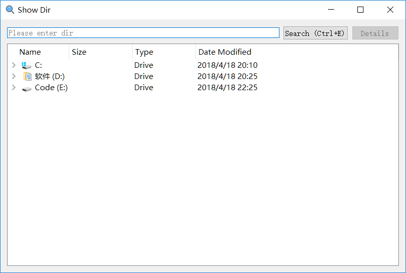

# 目录查看小工具

## 特性
- 用户输入一个文件路径后，可以迅速列出该目录包含的文件和文件夹
- 通过Details按钮来获取文件详细信息，包括文件大小（文件夹就显示文件夹大小）

## 软件截图

- 开始界面

小工具运行最开始时显示根目录，即所有盘符

- 搜索
    - 小工具搜索所要显示的目录即会将该目录显示出来
    - 可以通过树形结构往下查看
    - 错误的目录还提示无该目录
    - 不输入目录search将返回根目录

- 详情
    - 选中某一文件，点击Details可以看到该文件的大小，名称，所在位置
    - 若选中的是目录，该目录的大小需下次点详情才能显示（第一次的时候，线程后台递归计算目录大小）
    - 且下一次查看的时候，该目录下所有的子目录的文件夹大小均已被记录，不需要再计算

- 检测变化
    - 当目录下有文件变动，小工具也是及时更新的

